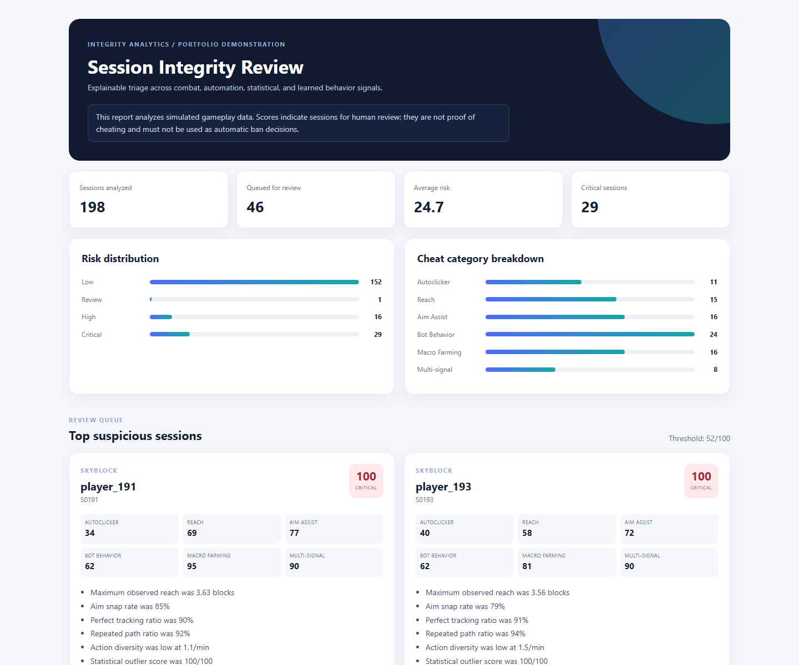

# Data-Driven Anti-Cheat Pipeline

An explainable integrity-analysis portfolio project for aggregate Minecraft-style
gameplay telemetry. The pipeline turns simulated sessions into a prioritized
human-review queue using configurable rules, robust statistical outliers, and a
small logistic model.

> **Portfolio demo, not a production anti-cheat.** All included gameplay data is
> simulated. A high score is an investigation lead, not proof of cheating or a
> reason to automatically punish a player.



## What It Demonstrates

- Category-specific detection for autoclicker, reach, aim assist, bot behavior,
  macro farming, and multi-signal suspicious behavior
- Explainable evidence attached to every session queued for review
- Robust median/MAD outlier analysis that is less sensitive to extreme samples
- A dependency-free logistic model used as a supporting signal
- Editable TOML thresholds and weights
- Standalone HTML review report plus detailed and category-level CSV exports
- Typed, documented Python modules with focused unit and end-to-end tests

## Quick Start

Python 3.11 or newer is required.

```bash
pip install -r requirements.txt
python -m anticheat_pipeline --input data/gameplay_sessions.csv --output reports
```

Generated artifacts:

- `reports/anti_cheat_report.html`: analyst-oriented dashboard
- `reports/player_assessments.csv`: complete session-level scores and evidence
- `reports/category_summary.csv`: category review counts and score summaries

Run the tests:

```bash
python -m pytest
```

Generate a fresh deterministic simulated dataset:

```bash
python -m anticheat_pipeline --generate-sample data/gameplay_sessions.csv --output reports
```

Use a different configuration:

```bash
python -m anticheat_pipeline \
  --input data/gameplay_sessions.csv \
  --output reports \
  --config config/detection.toml
```

## Detection Flow

```text
session CSV
  -> validation and feature engineering
  -> category-specific explainable rules
  -> robust population outlier score
  -> lightweight logistic model probability
  -> weighted risk aggregation
  -> HTML and CSV review artifacts
```

The final risk score combines three intentionally distinct layers:

| Layer | Purpose |
|---|---|
| Rules | Capture known, explainable patterns by cheat category |
| Outliers | Surface behavior that is unusual relative to the observed population |
| Model | Learn combinations of signals from a separate simulated reference corpus |

Configuration lives in [`config/detection.toml`](config/detection.toml). Rule
thresholds, category weights, risk tiers, and layer aggregation weights can be
changed without editing Python code.

## Project Structure

```text
anticheat_pipeline/
  cli.py          command-line interface
  config.py       typed TOML configuration
  features.py     input validation and feature engineering
  scoring.py      category-specific explainable rules
  outliers.py     robust statistical profiling
  model.py        lightweight logistic regression
  pipeline.py     orchestration and risk aggregation
  reports.py      HTML and CSV report generation
  simulator.py    deterministic simulated telemetry
config/           editable detection settings
data/             simulated input sessions
docs/             technical design notes
reports/          generated review artifacts
tests/            focused unit and end-to-end tests
```

## Operational Positioning

This project is designed to show how data engineering and detection ideas can
support an anti-cheat team. It deliberately does **not** claim packet-level
coverage, adversarial robustness, production calibration, or validated
false-positive rates. In a real network, these aggregate signals would feed a
versioned review system, be segmented by game mode and client/server context,
and be evaluated on labeled investigation outcomes before enforcement use.

See [`docs/technical-design.md`](docs/technical-design.md) for the approach,
limitations, and a practical scaling path.
